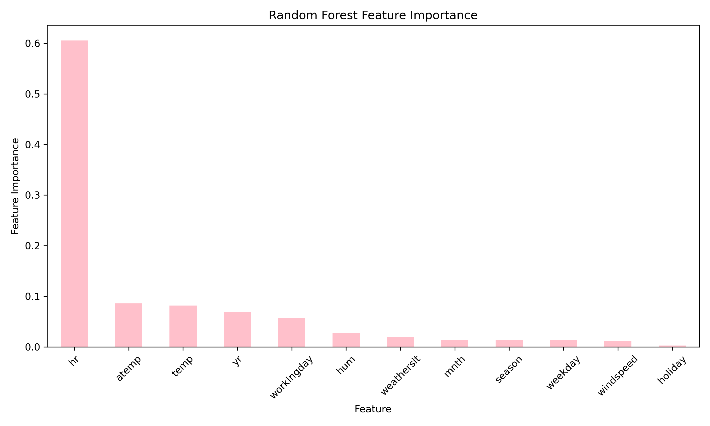
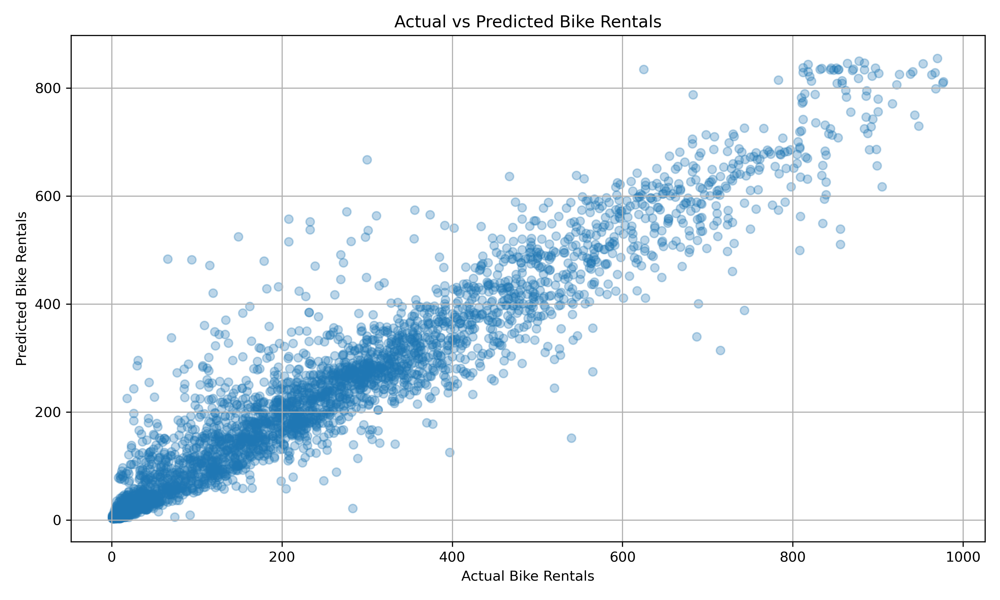
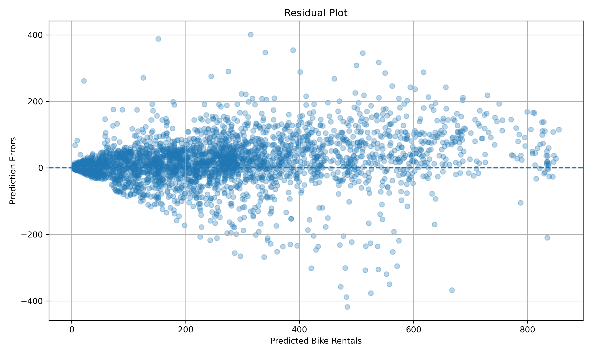

# Predicting Bike-Sharing Demand Using Statistical Analysis and Machine Learning

## Project Overview

This project analyzes hourly bike-sharing demand using the UCI Bike Sharing Dataset. The analysis combines exploratory data analysis, statistical reasoning, data visualization, and machine learning to identify factors associated with bike rental demand and predict hourly rental counts.

The project focuses on patterns in demand across different hours, working-day status, weather conditions, and temperature. Linear Regression and Random Forest Regression models were developed and evaluated using a chronological train-test split.

## Dataset

The dataset contains hourly bike rental records from 2011 to 2012, together with information about:

- Time and date
- Season
- Weather conditions
- Temperature
- Humidity
- Wind speed
- Working-day status
- Total bike rentals

The target variable is `cnt`, representing the total number of bike rentals during each hour.

## Research Questions

This project investigates:

1. How does bike rental demand vary throughout the day?
2. How does working-day status relate to hourly rental demand?
3. How are weather conditions associated with rental demand?
4. What is the relationship between temperature and bike rental demand?
5. How well can machine learning models predict hourly rental demand?
6. Which variables are most important for prediction?

## Exploratory Data Analysis

The analysis examined:

- Average bike rentals by hour
- Working-day versus non-working-day demand
- Average demand across weather categories
- The relationship between temperature and rental demand
### Bike Rental Demand by Hour


### Working Day vs Non-Working Day


### Temperature and Bike Rental Demand


Key findings included:

- The highest average demand occurred at 5:00 PM, with approximately 461 rentals per hour.
- The lowest average demand occurred at 4:00 AM, with approximately 6 rentals per hour.
- Working-day and non-working-day demand showed different patterns across the hours of the day.
- Average demand generally decreased as weather conditions became less favorable.
- Temperature had a moderate positive association with rental demand, with a Pearson correlation of approximately 0.405.

## Machine Learning

Two regression models were evaluated:

### Linear Regression

Linear Regression was used as a baseline model.

### Random Forest Regression

Random Forest Regression was used to capture nonlinear relationships and interactions between the predictors.

The models were evaluated using:

- Mean Absolute Error (MAE)
- R²

A chronological train-test split was used, with the first 80% of observations used for training and the later 20% used for testing.
### Random Forest Feature Importance



### Actual vs Predicted Rental Demand



### Residual Plot



## Results

The chronological evaluation showed that Random Forest Regression performed substantially better than the Linear Regression baseline.

The Random Forest model also identified `hr` (hour of the day) as the most important predictor, followed by `atemp`, `temp`, `yr`, and `workingday`.

## Key Findings

- Time of day was strongly associated with bike rental demand.
- Working-day status was associated with different hourly demand patterns.
- Poorer weather conditions were associated with lower average rental demand.
- Temperature showed a moderate positive association with demand.
- Random Forest captured the patterns in the data better than Linear Regression.
- Hour of the day was the most important feature in the Random Forest model.

## Limitations

The dataset represents bike-sharing activity during 2011 and 2012, so the findings may not generalize to other cities or time periods.

The model also does not include factors such as major events, traffic conditions, public transport disruptions, or bike availability.

Feature importance describes the contribution of variables to the fitted model and should not be interpreted as evidence of causation.

## Tools and Technologies

- Python
- Pandas
- NumPy
- Matplotlib
- Scikit-learn
- Jupyter Notebook
- VS Code

## Project Structure

```text
bike-sharing-demand-analysis/
├── data/
│   └── hour.csv
├── figures/
├── notebooks/
│   └── bike_sharing_analysis.ipynb
└── README.md